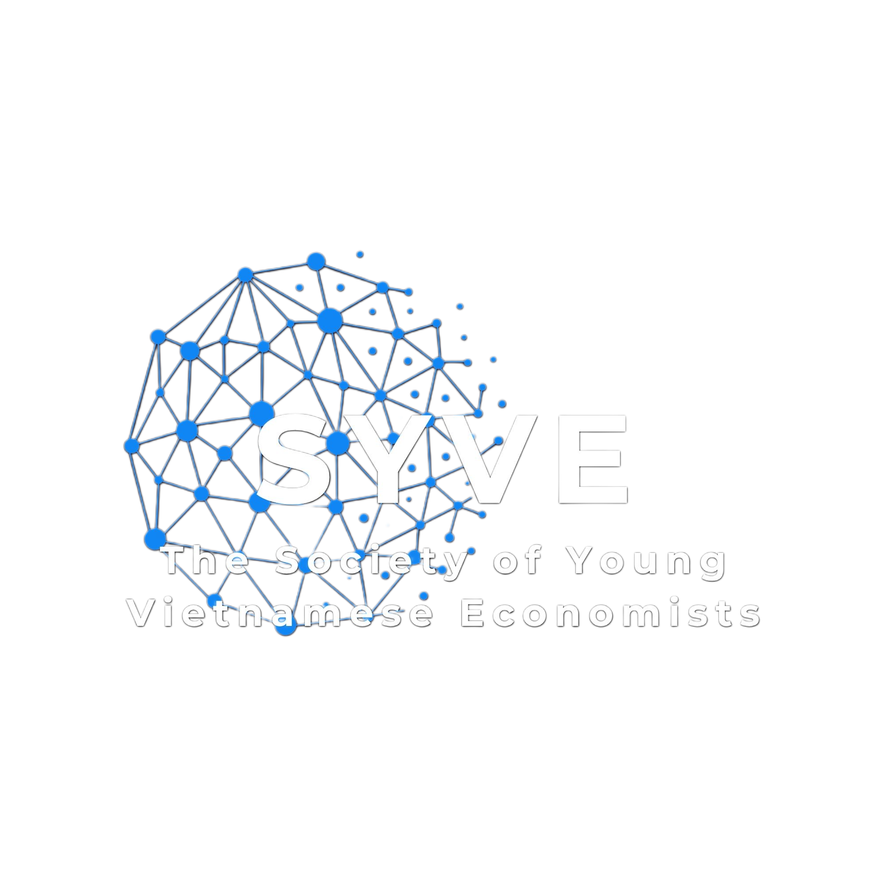

<h1 align="center">The Society of Young Vietnamese Economists (SYVE)</h1>

A community of young Vietnamese economists fostering academic exchange, collaborative research, and intellectual growth in economics.

## About

SYVE brings together PhD students, postdocs, and early-career researchers in economics from Vietnamese backgrounds at universities and institutions worldwide.

## Features

- **Seminars & Reading Groups** -- Weekly reading groups discussing classic and seminal economics papers
- **Research Groups** -- Collaborative research across key areas of economics (forthcoming)
- **Blog** -- News, updates, and insights from the community
- **Member Profiles** -- Connecting our growing network of economists

## Built With

This website is built using the [Lab Website Template](https://github.com/greenelab/lab-website-template) by Greene Lab.

## Contact

- Email: syve.info@gmail.com
- GitHub: [syve-econ](https://github.com/syve-econ)
